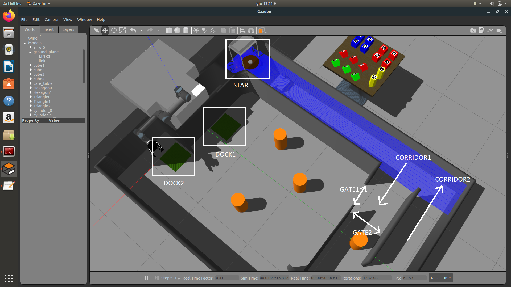

# Homework3 - Navigation

Implement a routine that lets Marrtino navigate inside the arena of Figure 1. This arena is composed of an open  space, populated by  movable  obstacles, and some narrow corridors. The  robot has to navigate from *START* to a free docking station (*DOCK1* or *DOCK2*), where the manipulator robot will unload manipulated objects (in Homework 4).
Only one gate (*GATE1* or *GATE2*) is open per time and the robot is forced to cross that free gate to reach the free docking  station. Once the mobile robot reaches the free docking station, it has to come back to *START* by crossing the second corridor. As depicted in Figure 1, corridors are one-way!

Suggestions:

- Use  the  ROS  navigation  stack  in  order  to  navigate  within  the  open  space.  You  need  to  correctly tune the navigation parameters;
- Implement your own routine in order to navigate through the narrow corridors: use the laser scans to make the robot move in the middle of each narrow corridor;
- Backup  routines  will  be  desirable  to  avoid  obstacles.  By  default,  the  robot  rotates  on  itself  if  it does not find a free path.

Figure 1 - Arena
